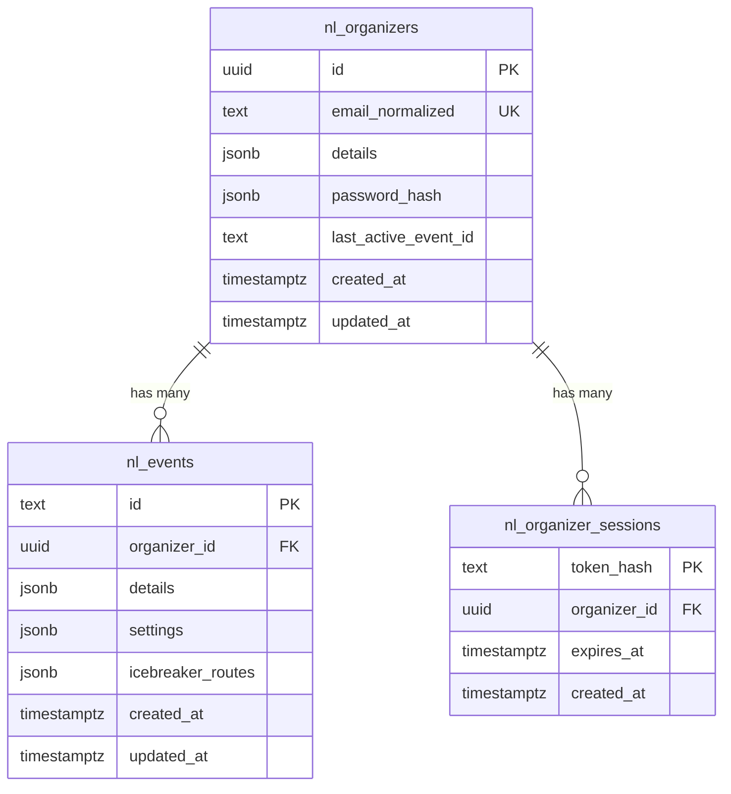

# Organizer data model (Postgres / Supabase)

This document describes the **organizer** side of the runtime schema: accounts, event-scoped configuration, and opaque API sessions. It maps to [spec 10](../features/10_organizer_auth_and_event_store.md) and the current API implementation in [`api/organizer-auth-store.js`](../../api/organizer-auth-store.js).

**Canonical DDL:** [`20260512140000_initial_app_runtime.sql`](../../supabase/migrations/20260512140000_initial_app_runtime.sql) (`public` schema).

---

## Entity relationship (logical)



- One **organizer** has many **events**; each **event** belongs to one organizer.
- **Sessions** reference an organizer; the raw bearer token is **never** stored (only a hash; see [Sessions](#nl_organizer_sessions)).

---

## `nl_organizers`

| Column | Type | Nullable | Description |
|--------|------|----------|-------------|
| `id` | `uuid` | no | Primary key. Same role as `organizer.key` in spec 10 (system-generated UUID). |
| `email_normalized` | `text` | no | Login identity; **unique**; store lowercased/trimmed. |
| `details` | `jsonb` | no | Public-ish organizer profile. Default `{}`. Shape today: `name`, `email` (see [JSON shapes](#json-shapes)). |
| `password_hash` | `jsonb` | no | Password material for email login. See [Password hash JSON](#password_hash-json) (e.g. scrypt parameters + salt + hash, not plaintext). |
| `last_active_event_id` | `text` | yes | `nl_events.id` the organizer last selected in the UI (aligns with `lastActiveEventKey` in the file store). |
| `created_at` | `timestamptz` | no | Set on insert. |
| `updated_at` | `timestamptz` | no | Bump on any organizer row change (convention; enforce in app or trigger). |

**Indexes / constraints:** PK on `id`, unique on `email_normalized`.

**Spec 10 mapping:** `key` → `id`. The nested `organizers[]` array in the legacy JSON file becomes one row per organizer.

---

## `nl_events`

| Column | Type | Nullable | Description |
|--------|------|----------|-------------|
| `id` | `text` | no | Primary key. Same role as `event_key` in spec 10 (UUID string is fine). **Unique per organizer** in product rules; enforced by app ( composite uniqueness not in v1 migration). |
| `organizer_id` | `uuid` | no | FK → `nl_organizers.id` **ON DELETE CASCADE**. |
| `details` | `jsonb` | no | Event-level display info. Default `{}`. e.g. `{ "name": "NexusLink Event" }`. |
| `settings` | `jsonb` | no | Full **organizer settings** document for this event: `eventInfo`, `organizer`, `parameters`, `icebreakerRoutes`, `icebreakerRoutesDraft`, `icebreakerRoutesHistory`, etc. Same shape as `ev.settings` in the file store and `globalThis.__organizerSettings` for the active event. |
| `icebreaker_routes` | `jsonb` | yes | Denormalized copy of the **published** route catalog (mirrors `settings.icebreakerRoutes` / `icebreaker_routes` in the file store). Can be null; server may always derive from `settings` if preferred. |
| `created_at` | `timestamptz` | no | |
| `updated_at` | `timestamptz` | no | |

**Indexes:** `nl_events_organizer_id_idx` on `organizer_id`.

**Spec 10 mapping:** each entry in `organizer.events[]` → one `nl_events` row. `event_key` → `id`.

---

## `nl_organizer_sessions`

| Column | Type | Nullable | Description |
|--------|------|----------|-------------|
| `token_hash` | `text` | no | Primary key. **Hash of the opaque session token** (e.g. SHA-256 hex of the token bytes). Never store the raw token. |
| `organizer_id` | `uuid` | no | FK → `nl_organizers.id` **ON DELETE CASCADE**. |
| `expires_at` | `timestamptz` | no | Session expiry; server must reject `expires_at < now()`. |
| `created_at` | `timestamptz` | no | |

**Indexes:** `nl_organizer_sessions_expires_at_idx` on `expires_at` (for cleanup jobs).

**Transport (unchanged from spec 10):** client sends `Authorization: Bearer <opaque_token>`. API hashes the token, looks up `token_hash`, checks `organizer_id` and `expires_at`.

**Why this table exists:** on **Vercel serverless**, in-memory session maps do not survive across instances. Persisting rows here (or an equivalent store) is required for reliable **401/200** behavior.

---

## JSON shapes

### `details` (organizer)

Example (aligned with current demo / signup):

```json
{
  "name": "Demo Organizer",
  "email": "organizer@example.com"
}
```

### `settings` (event)

This is the large **event settings** object: `eventInfo`, `organizer` (creds, social, `llm`), `questionRoutes`, `parameters` (onboarding, matching), `attendance`, `freebies`, `physicalMeetup`, and icebreaker fields (`icebreakerRoutes`, `icebreakerRoutesDraft`, `icebreakerRoutesHistory`). Treat as **versioned by product**; the API validator in `api/handler.js` is the current contract for published saves.

### `password_hash` JSON

The API uses **scrypt** (Node `crypto`); stored object shape is along the lines of:

```json
{
  "algo": "scrypt",
  "saltB64": "<base64>",
  "hashB64": "<base64>",
  "N": 16384,
  "r": 8,
  "p": 1,
  "dkLen": 64
}
```

Source of truth for generation/verification: [`api/organizer-auth-store.js`](../../api/organizer-auth-store.js) (`scryptHashPassword` / `verifyPassword`).

---

## Row Level Security (RLS)

Migrations do **not** enable RLS. The **Table Editor** may show tables as **UNRESTRICTED**. Intended access for MVP:

- **Server** (`api/handler.js`) uses a **pooled or direct** Postgres connection or Supabase **service** role to read/write.
- If the **browser** ever used Supabase client keys against these tables, you would add RLS policies and stop using the service key in the client.

---

## Implementation status (repo)

| Area | Migrated (SQL) | Wired in `api/*` |
|------|----------------|------------------|
| `nl_organizers` / `nl_events` | Yes | **Yes** when `POSTGRES_URL` / `POSTGRES_PRISMA_URL` is set — see `api/organizer-pg.js` + `api/organizer-auth-store.js`. |
| `nl_organizer_sessions` | Yes | **Yes** when Postgres env is set — opaque bearer tokens stored as **SHA-256** hashes in `token_hash`. |

**Fallback:** no `POSTGRES_URL` → legacy JSON file (`data/organizer-store.json`) + in-memory session `Map` for local dev.

**Next steps (optional):** migration script from `data/organizer-store.json` into `nl_*` for existing dev data; session TTL cleanup job.

---

## Changelog

- **2026-05-12:** Initial doc; matches `20260512140000_initial_app_runtime.sql`.
